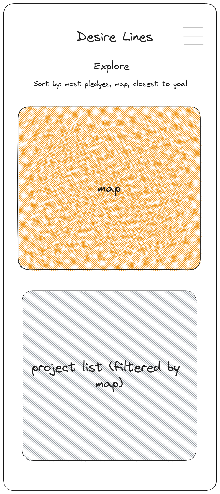
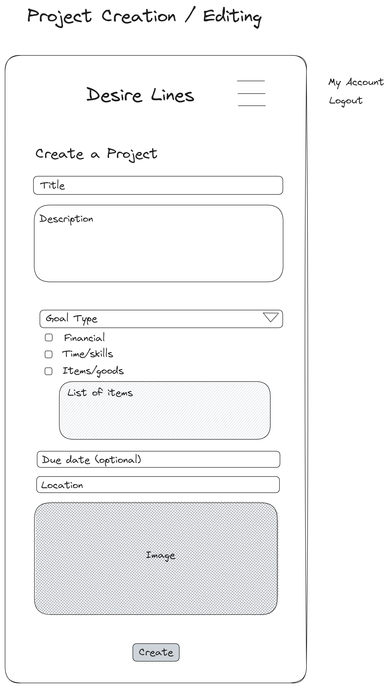
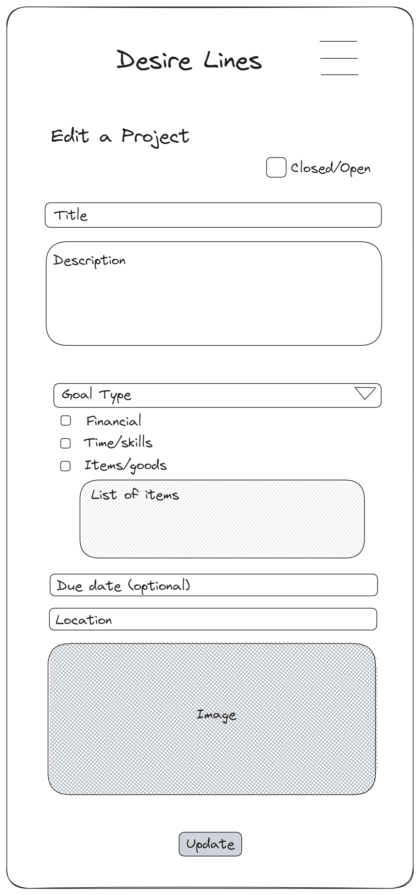
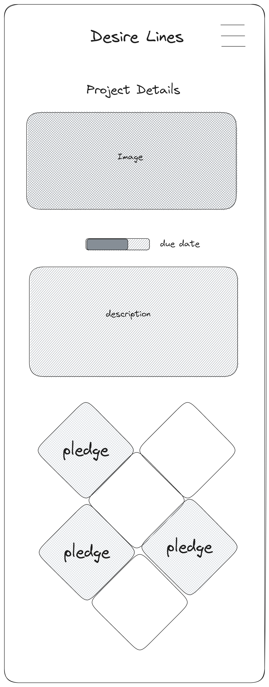
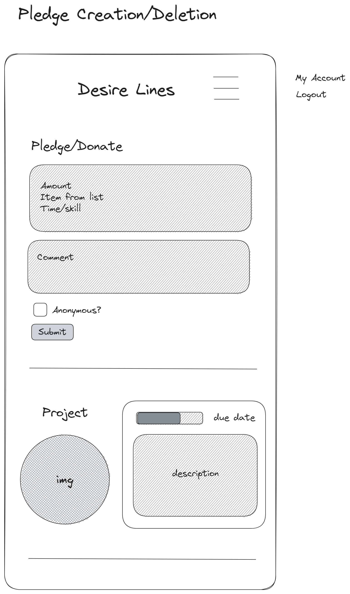
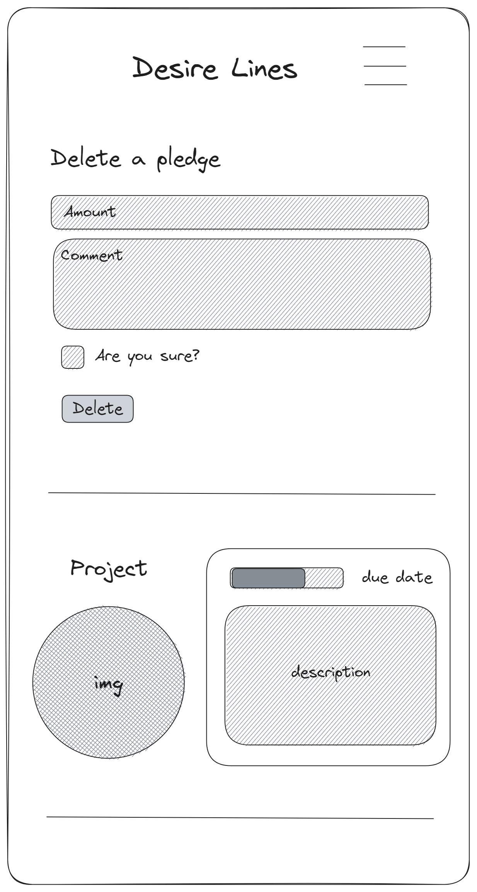
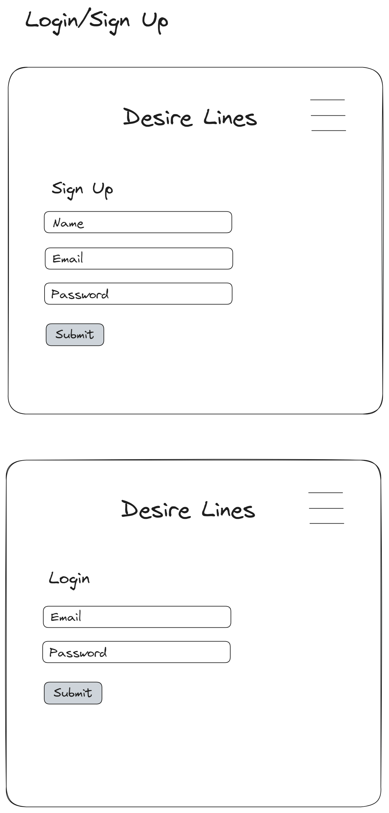
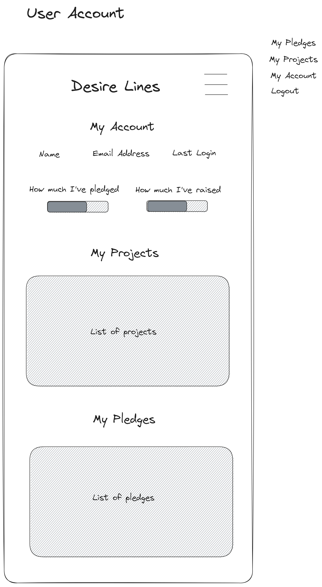

# Desire Lines (Back End)
 
by Maya Dominice

She Codes Plus crowdfunding project - DRF Backend.

## About
Empowering the community to tackle urban design issues at the micro level to create cleaner, safer, welcoming, engaging and connected spaces; ultimately improving the health and wellbeing through urban design.

## Features
{{ The features your MVP will include. (Remebber this is a working document, you can change these as you go!) }}
* [] Create an account
* [] Login/Logout
* [] Password Reset
* [] Create a project
* [] Create project through map - get x,y from map to auto-populate location
* [] Donate/pledge to a project
* [] View user profile
    * [] List projects
    * [] List pledges
* [] Search for projects
* [] Bookmark/watch projects
* [] List projects with highest pledges/closest to completion
* [] Vote for projects
* [] List projects with highest votes

### Stretch Goals
{{ Outline three features that will be your stretch goals if you finish your MVP }}
* [] Email out to pledgers when complete/send updates
* [] Vote on projects
* [] Visual of 'most popular projects'
* [] Map of projects with pop-up to project
* [] OAuth2 authentication
* [] Geo-magic to connect locations visual (nearest neighbour, shortest route, pedshed)

## API Specification

| HTTP Method | Url | Purpose | Request Body | Successful Response Code | Authentication   Authorization
| --- | ------- | ------ | ---- | -----| ----|
| GET | /projects/ | Return all projects | N/A | 200 | N/A |
| POST | /projects/ | Create a new project | project object | 201 | User must be logged in. |
| GET | /projects/1 | Returns the project with ID of '1' (Project detail page) and all associated information and pledges | N/A | 200 | N/A |
| PUT | /projects/1 | Updates the project with ID of '1' | Project object | 200 | User must be logged in. Must be project owner.|
| POST| /pledges/ | Create a new pledge | Pledge object| 201 | User must be logged in. Must not be the owner of the project. |
| GET | /pledges/1 | Returns the pledge with ID of '1' | N/A | 200 | N/A |
| DELETE | /pledges/1 | Deletes the pledge with ID of '1' | N/A | 200 | User must be logged in. Must be pledge owner. |
| GET | /users/1 | Return user with ID of '1' | N/A | 200 | User of ID '1' must be logged in. |

A table showing what api can do; url = endpoints; authorisation/authentication --> specific user/privileges

## Database Schema
{{ Insert your database schema }}

## Wireframes
{{ Insert your wireframes }}

    

    

    

   

## Colour Scheme
{{ Insert your colour scheme }}

## Fonts
{{ outline your heading & body font(s) }}
----> stop here ---> Saturday

## Submission Documentation
{{ Fill this section out for submission }}

Deployed Project: [Deployed website](http://linkhere.com/)

### How To Run
{{ What steps to take to run this code }}

### Updated Database Schema
{{ Updated schema }}

### Updated Wireframes
{{  Updated wireframes }}

### How To Register a New User
{{ Step by step instructions for how to register a new user and create a new project (i.e. endpoints and body data). }}

### Screenshots
* [] A screenshot of Insomnia, demonstrating a successful GET method for any endpoint.

* [] A screenshot of Insomnia, demonstrating a successful POST method for any endpoint.

* [] A screenshot of Insomnia, demonstrating a token being returned.

