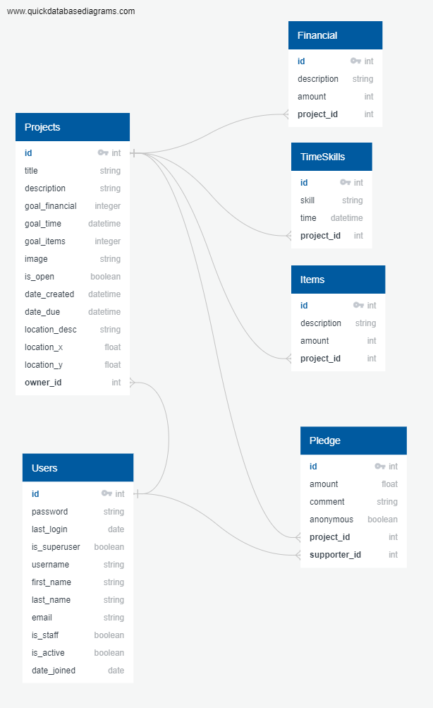

# Desire Lines (Back End)
 
by Maya Dominice

She Codes Plus crowdfunding project - DRF Backend.

## Submission Content for Part A - DRF 

[ ] A link to the deployed project.
The project is deployed at this URL: https://desirelines-backend.fly.dev/projects/

[ ] A screenshot of Insomnia, demonstrating a successful GET method for any endpoint.

  

[ ] A screenshot of Insomnia, demonstrating a successful POST method for any endpoint.

  

[ ] A screenshot of Insomnia, demonstrating a token being returned.

  

[ ] Step by step instructions for how to register a new user and create a newproject (i.e. endpoints and body data).

[ ] Your refined API specification and Database Schema.

### API Specification

| HTTP Method | Url | Purpose | Request Body | Successful Response Code | Authentication   Authorization
| --- | ------- | ------ | -- | -----| ----|
| GET | /projects/ | Return all projects | N/A | 200 | N/A |
| GET | /projects/1 | Returns the project with ID of '1' (Project detail page) and all associated information and pledges | N/A | 200 | N/A |
| GET | /pledges/ | Returns all pledges | N/A | 200 | N/A |
| GET | /pledges/1 | Returns the pledge with ID of '1' | N/A | 200 | N/A |
| GET | /users/ | Return all users| N/A | 200 | User logged in must be admin user. *permissions not implemented yet... |
| GET | /users/1 | Return user with ID of '1' | N/A | 200 | User of ID '1' must be logged in. *permissions not implemented yet... |
| POST | /users/ | Create new user | Example request body:  { "username":"User2",  "email":"emailaddress",  "password":"yourpassword" } | 201 | N/A |
| POST | /projects/ | Create a new project | Example request body:   { "title":"Project1", "description":"An example project", "goal":5, "image":"https://exampleimage.jpg", "is_open":true, "date_created": "2023-08-12T00:00:00Z", "location_desc":"Brisbane", "location_x":27.4705, "location_y":153.0260  } | 201 | User must be logged in/authorized (via token). |
| POST| /pledges/ | Create a new pledge | Example request body:   { "amount":8, "comment":"This is another pledge", "anonymous":false, "project":2 } | 201 | User must be logged in/authorized (via token). |
| PUT | /projects/1 | Updates the project with ID of '1' | Example request body:    { "id":1 "title":"Project1", "description":"An example project", "goal":5, "image":"https://exampleimage.jpg", "is_open":true, "date_created": "2023-08-12T00:00:00Z", "location_desc":"Brisbane", "location_x":27.4705, "location_y":153.0260  }| 201 | User must be logged in/authorized (via token). Must be project owner.|
| PUT | /pledges/1 | Updates the pledge with ID of '1' | Example request body:  { "id":1, "amount":8, "comment":"This is another pledge", "anonymous":false, "project":2 } | 201 | User must be logged in. Must be pledge creator/supporter.|

### Database Schema
  

## About
Deriving from the urban planning paradigm of the unplanned links forged by people following the path they desire, not the path planned for them, this 
crowdfunding platform is aimed at providing agency and empowerment to local communities to tackle urban design issues in their neighbourhoods.

Design of and safe mobility through spaces that people inhabit are vital to human health and wellbeing,
and often those who live in the area know what's needed best where: one only needs to look for the desire lines already there.

Examples of projects could include community verge gardens, little public libraries, parklets, natural playground equipment, benches/tables or other seating amenities,
lighting, artwork pieces, connective pathways, vehicle traffic slowing devices and many more. 

## Features
{{ The features your MVP will include. (Remebber this is a working document, you can change these as you go!) }}
* [ ] Create an account
* [ ] Login/Logout
* [ ] Create a project
* [ ] Geo-locate (auto-populate address field) and get XY coordinates
* [ ] Project owner privileges:
  * [ ] Update status of a project (open/closed)
* [ ] User privileges (logged in)
  * [ ] Create a project
  * [ ] Donate/pledge to an existing project
  * [ ] Donate/pledge to one's own project
* [ ] Pledges non-editable (ie can't withdraw or edit pledge once submitted)
* [ ] View user profile (if user logged in)
    * [ ] List user's projects
    * [ ] List user's pledges
* [ ] View project details (no login required)
* [ ] View map of projects using XY coordinates (no login required)
* [ ] View list projects with highest pledges/closest to completion (no login required)

### Stretch Goals
{{ Outline three features that will be your stretch goals if you finish your MVP }}
* [ ] Password reset for user
* [ ] Edit certain account details for logged in user
* [ ] Bookmark/watch projects for logged in user
* [ ] Search for projects (no login required)
* [ ] Email out to pledgers when complete/send updates (for logged in project owner)
* [ ] Vote on projects (anonymously - to see which projects community really wants)
  * [ ] Method to control how/amount of votes (ie to avoid being susceptible to a bot/dos attack....) 
  * [ ] List of projects with highest votes
* [ ] Create project through map - get x,y from map to auto-populate location fields
* [ ] OAuth2 authentication
* [ ] Geo-magic to connect locations as a line
* [ ] Pedshed visual from project locations (similar to what Google is now starting to roll-out as 'x-minute walk' blobs from a point)

## API Specification

| HTTP Method | Url | Purpose | Request Body | Successful Response Code | Authentication   Authorization
| --- | ------- | ------ | -- | -----| ----|
| GET | /projects/ | Return all projects | N/A | 200 | N/A |
| GET | /projects/1 | Returns the project with ID of '1' (Project detail page) and all associated information and pledges | N/A | 200 | N/A |
| GET | /pledges/ | Returns all pledges | N/A | 200 | N/A |
| GET | /pledges/1 | Returns the pledge with ID of '1' | N/A | 200 | N/A |
| GET | /users/ | Return all users| N/A | 200 | User logged in must be admin user. *permissions not implemented yet... |
| GET | /users/1 | Return user with ID of '1' | N/A | 200 | User of ID '1' must be logged in. *permissions not implemented yet... |
| POST | /users/ | Create new user | Example request body:  { "username":"User2",  "email":"emailaddress",  "password":"yourpassword" } | 201 | N/A |
| POST | /projects/ | Create a new project | Example request body:   { "title":"Project1", "description":"An example project", "goal":5, "image":"https://exampleimage.jpg", "is_open":true, "date_created": "2023-08-12T00:00:00Z", "location_desc":"Brisbane", "location_x":27.4705, "location_y":153.0260  } | 201 | User must be logged in/authorized (via token). |
| POST| /pledges/ | Create a new pledge | Example request body:   { "amount":8, "comment":"This is another pledge", "anonymous":false, "project":2 } | 201 | User must be logged in/authorized (via token). |
| PUT | /projects/1 | Updates the project with ID of '1' | Example request body:    { "id":1 "title":"Project1", "description":"An example project", "goal":5, "image":"https://exampleimage.jpg", "is_open":true, "date_created": "2023-08-12T00:00:00Z", "location_desc":"Brisbane", "location_x":27.4705, "location_y":153.0260  }| 201 | User must be logged in/authorized (via token). Must be project owner.|
| PUT | /pledges/1 | Updates the pledge with ID of '1' | Example request body:  { "id":1, "amount":8, "comment":"This is another pledge", "anonymous":false, "project":2 } | 201 | User must be logged in. Must be pledge creator/supporter.|

## Database Schema
{{ Insert your database schema }}

## Wireframes
{{ Insert your wireframes }}

    

    

    

   

## Colour Scheme
{{ Insert your colour scheme }}

## Fonts
{{ outline your heading & body font(s) }}
----> stop here ---> Saturday

## Submission Documentation
{{ Fill this section out for submission }}

Deployed Project: [Deployed website](http://linkhere.com/)

### How To Run
{{ What steps to take to run this code }}

### Updated Database Schema
{{ Updated schema }}

### Updated Wireframes
{{  Updated wireframes }}

### How To Register a New User
{{ Step by step instructions for how to register a new user and create a new project (i.e. endpoints and body data). }}

### Screenshots
* [] A screenshot of Insomnia, demonstrating a successful GET method for any endpoint.

* [] A screenshot of Insomnia, demonstrating a successful POST method for any endpoint.

* [] A screenshot of Insomnia, demonstrating a token being returned.

