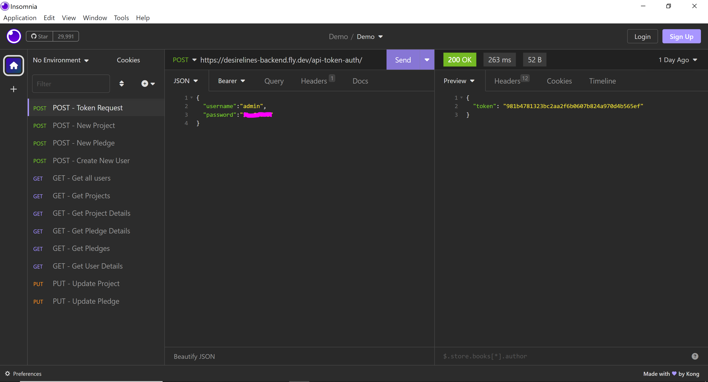

# Desire Lines (Back End)
 
by Maya Dominice

She Codes Plus crowdfunding project - DRF Backend.

## Submission Documentation for Part A - DRF 

* [ ] **A link to the deployed project.**
  
  The project is deployed at this URL: https://desirelines-backend.fly.dev/projects/

* [ ] **A screenshot of Insomnia, demonstrating a successful GET method for any endpoint.**

  

* [ ] **A screenshot of Insomnia, demonstrating a successful POST method for any endpoint.**

  

* [ ] **A screenshot of Insomnia, demonstrating a token being returned.**

  

* [ ] **Step by step instructions for how to register a new user and create a new project (i.e. endpoints and body data).**

  #### Register a new user
  Using an interface/program of choice (such as Insomnia, Postman or SOAPUI), configure the following request:
  
  - Method: POST
  
  - Endpoint: https://https://desirelines-backend.fly.dev/users/

  No authentication is needed, but if content-type configuration isn't already configured, set this header value to:
  
  - Content-Type | application/json

  Configure the body of the request as json, with the following fields:
  ```json
  {
      "username": "UserName",
      "email": "youremail@address.com",
      "password": "YourPassword"
  }
  ```
  On successful send, a 200 response is expected with a json response body returned showing the created user:

  ```json
  {
      "id": 4,
      "last_login": null,
      "is_superuser": false,
      "username": "User3",
      "first_name": "",
      "last_name": "",
      "email": "user3@gmail.com",
      "is_staff": false,
      "is_active": true,
      "date_joined": "2023-08-13T00:18:13.602362Z",
      "groups": [],
      "user_permissions": []
  }
  ```

  #### How To Create a New Project
  
  Creating a new project requires a user to be authenticated ('logged in'), and this is implemented through token authentication. 
  
  #### Step 1: Generate a token
    
    Using an interface/program of choice (such as Insomnia, Postman or SOAPUI), configure the following request:
    
    - Method: POST
    
    - Endpoint: https://https://desirelines-backend.fly.dev/api-token-auth/
  
    - Content-Type | application/json
  
    Configure the body of the request as json, with the following fields:
    ```json
    {
        "username": "UserName",
        "password": "YourPassword"
    }
    ```
    On successful send, a 200 response is expected with a json response body returned with the token value:
    ```json
    {
    "token": "abcdefghijklmnopqrstuvwxyz123456789"
    }
    ```
  #### Step 2: Create a project using the token to authenticate the request
  
    Configure a new request with the following settings:
    
    - Method: POST
    
    - Endpoint: https://https://desirelines-backend.fly.dev/projects/
  
    - Content-Type | application/json
  
    Under Authentication types/settings, set Authentication method to 'Bearer Token' (this may vary slightly across interfaces eg in Postman, set it to API Key and include the word 'Token ' prefixed to the token set as API Key).
  
    Copy the token value returned from Step 1 and paste into the token value field.
  
    Configuree the body of the request as json, with the following fields:
  
    ```json
    {
           "title": "My Project",
           "description": "An example project",
           "goal": 5,
           "image": "https://exampleimage.jpg",
           "is_open": true,
           "date_created": "2023-08-12T00:00:00Z",
           "location_desc": "Brisbane",
           "location_x": 27.4705,
           "location_y": 153.0260
    }  
    ```
    On successful send, a 201 response is expected with a json response body returned showing the created project details, including the owner and project id:

    ```json
    {
    	"id": 2,
    	"owner": 1,
    	"title": "My Project",
    	"description": "An example project",
    	"goal": 5,
    	"image": "https://exampleimage.jpg",
    	"is_open": true,
    	"date_created": "2023-08-12T00:00:00Z",
    	"location_desc": "Brisbane",
    	"location_x": 27.4705,
    	"location_y": 153.026
    }
    ```
    
* [ ] **Your refined API specification and Database Schema.**

  Read on to see project concept details including API specification & schema :)
      


# 


# Project Concept Details

## About
Deriving from the urban planning paradigm of the unplanned links forged by people following the path they desire, not the path planned for them, this 
crowdfunding platform is aimed at providing agency and empowerment to local communities to tackle urban design issues in their neighbourhoods.

Design of and safe mobility through spaces that people inhabit are vital to human health and wellbeing,
and often those who live in the area know what's needed best where: one only needs to look for the desire lines already there.

Examples of projects could include community verge gardens, little public libraries, parklets, natural playground equipment, benches/tables or other seating amenities,
lighting, artwork pieces, connective pathways, vehicle traffic slowing devices and many more. 

## Features

* [ ] Create an account
* [ ] Login/Logout
* [ ] Create a project
* [ ] Geo-locate (auto-populate address field) and get XY coordinates using third party API (*might be a stretch goal...hopefully can make it happen)
* [ ] Project owner privileges:
  * [ ] Update status of a project (open/closed)
* [ ] User privileges (logged in)
  * [ ] Create a project
  * [ ] Donate/pledge to an existing project
  * [ ] Donate/pledge to one's own project
* [ ] Pledges non-editable (ie can't withdraw or edit pledge once submitted)
* [ ] View user profile (if user logged in)
    * [ ] List user's projects
    * [ ] List user's pledges
* [ ] View project details (no login required)
* [ ] View map of projects based on project's XY coordinates (no login required)
* [ ] View list projects with highest pledges/closest to completion (no login required)


### Stretch Goals

* [ ] Password reset for user
* [ ] Homepage list of projects filtered by map (spatial filter) - either default or as a toggle
* [ ] Edit certain account details for logged in user
* [ ] Bookmark/watch projects for logged in user
* [ ] Search for projects (no login required)
* [ ] Email out to pledgers when complete/send updates (for logged in project owner)
* [ ] Vote on projects (anonymously - to see which projects community really wants)
  * [ ] Method to control how/amount of votes (ie to avoid being susceptible to a bot/dos attack....) 
  * [ ] List of projects with highest votes
* [ ] Create project through map - get x,y from map to auto-populate location fields
* [ ] OAuth2 authentication
* [ ] Geo-magic to connect locations via line
* [ ] Pedshed visual from project locations (similar to what Google is now starting to roll-out as 'x-minute walk' blobs from a point)

## API Specification

| HTTP Method | Url | Purpose | Request Body | Successful Response Code | Authentication <br /> Authorization | Status/Comments |
| --- | ------- | ------ | -- | -----| ----|------|
| GET | /projects/ | Return all projects | N/A | 200 | N/A | Implemented |
| GET | /projects/1 | Returns the project with ID of '1' (Project detail page) and all associated information and pledges | N/A | 200 | N/A | Implemented |
| GET | /pledges/ | Returns all pledges | N/A | 200 | N/A | Implemented |
| GET | /pledges/1 | Returns the pledge with ID of '1' | N/A | 200 | N/A | Implemented |
| GET | /users/ | Return all users| N/A | 200 | User logged in must be admin user. | Partially completed - permissions not implemented yet |
| GET | /users/1 | Return user with ID of '1' | N/A | 200 | User of ID '1' must be logged in. | Partially completed - permissions not implemented yet |
| POST | /users/ | Create new user | Example request body:<br> ```{"username":"User2", "email":"emailaddress", "password":"yourpassword" }```<br>| 201 | N/A | Partially completed - returning a 200 response, needs to be updated to 201 |
| POST | /projects/ | Create a new project | Example request body: <br /> ```{"title":"Project1", "description":"An example project","goal":5, "image":"https://exampleimage.jpg", "is_open":true, "date_created": "2023-08-12T00:00:00Z", "location_desc":"Brisbane", "location_x":27.4705, "location_y":153.0260}``` <br /> | 201 | User must be logged in/authorized (via token). | Implemented |
| POST| /pledges/ | Create a new pledge | Example request body: <br /> ```{"amount":8, "comment":"This is another pledge", "anonymous":false, "project":2}``` <br /> | 201 | User must be logged in/authorized (via token). | Implemented |
| PUT | /projects/1 | Updates the project with ID of '1' | Example request body:  <br /> ```{"id":1, "title":"Project1", "description":"An example project", "goal":5, "image":"https://exampleimage.jpg", "is_open":true, "date_created":"2023-08-12T00:00:00Z", "location_desc":"Brisbane", "location_x":27.4705, "location_y":153.0260}``` <br />| 201 | User must be logged in/authorized (via token). Must be project owner.| Partially implemented, project owner permissions not yet configured |
| PUT | /pledges/1 | Updates the pledge with ID of '1' | Example request body:<br /> ```{"id":1, "amount":8, "comment":"This is another pledge", "anonymous":false, "project":2} ``` <br /> | 201 | User must be logged in. Must be pledge creator/supporter.| Partially impemented, permissions as pledge creator not yet configured.|


## Third Party API - Geocoding

I experimented with the Geoscape G-NAF Predictive API to see if I could incorporate the predictive address as part of the process to obtain X,Y coordinates of the project location (https://docs.geoscape.com.au/docs/oas-predictive-api/). Managed to get repsonses/interaction with the API through the views.py of Project, but wasn't quite sure how much further to push along this path or wait until we learn React and make it a front-end thing :) The bits of work I did on this are in the geoscape_api branch.


## Database Schema
The fields and tables relating to the goals arent't yet deployed - planning to try and include this so that users can create a project with three subtype goals - financial, time/skills and items - as often a community project takes on all these elements - eg for a community garden, some people can offer goods like soils, straw or seedlings, others can offer skills/time such as building a garden bed and others can offer money to purchase items such as soil, irrigation piping etc.

  

## Wireframes
Some initial concepts for the layout - designed in mobile view. 


    

    


    

   


## Colour Scheme

Aiming for inviting earthy tones such as these:


## Fonts

Planning to implement Google font pairings at this stage, such as this one:
https://www.fontpair.co/pairings/poiret-one-montserrat

- Headers: Poiret
- Body: Monserrat
